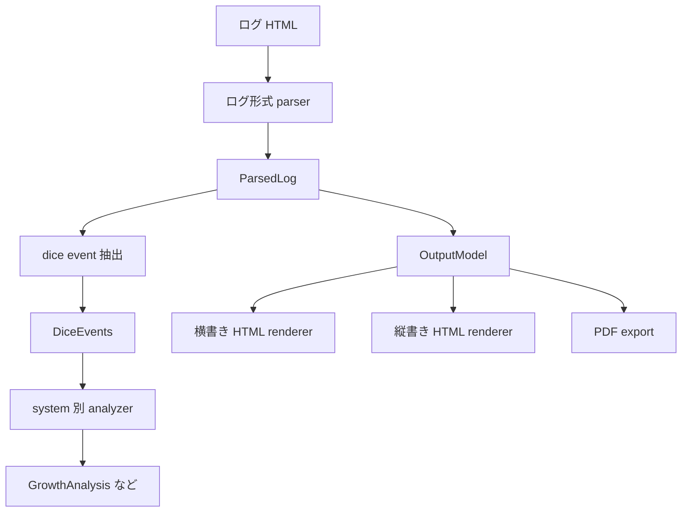
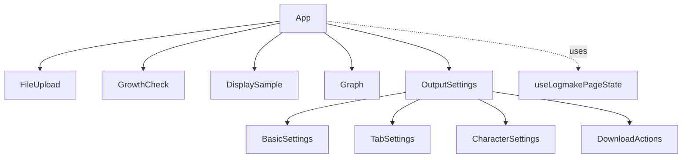

# Logmake Architecture

## 目的

`index_logmake.html` にまとまっていた Vue 実装を、React + TypeScript で読みやすく保守しやすい形へ移行する。

このページの主目的は、ユーザーが読み込んだ TRPG ログから、設定を反映した HTML ファイルをダウンロードできるようにすること。成長判定とグラフは、その作業を助ける補助機能として扱う。

## 入口

- `logmake/index.html`
  React 版ログ整形ツール専用の HTML 入口。
- `src/logmake/main.tsx`
  React を起動するだけのファイル。機能ロジックは置かない。
- `src/logmake/App.tsx`
  ページ全体の並びを決める場所。状態制御は `useLogmakePageState()` に寄せる。

## フォルダ責務

| 場所                               | 責務                                                                                           |
| ---------------------------------- | ---------------------------------------------------------------------------------------------- |
| `src/logmake/components/features/` | ユーザーが触る機能単位の UI。ファイル選択、成長判定、サンプル、グラフ、出力設定など。          |
| `src/logmake/hooks/`               | React のライフサイクルと関係する再利用処理。ファイル読込、初期技能値取得、クリップボードなど。 |
| `src/logmake/lib/`                 | React に依存しない純粋な処理。ログ解析、成長判定集計、出力モデル作成、HTML 生成など。          |
| `src/logmake/systems/`             | ゲームシステム別の adapter。ダイス抽出、成長判定、初期技能値を切り替える。                     |
| `src/logmake/styles/`              | logmake ページ専用 CSS Modules。旧 `styles.css` の見た目に寄せる。                             |
| `src/logmake/types/`               | TypeScript の型定義。データの形を先に読めるようにする。                                        |
| `src/logmake/test/`                | unit test と fixture。解析や出力の回帰確認に使う。                                             |

## データフロー

重要なのは、画面に出ている DOM から HTML を取り出さないこと。旧実装の hidden DOM + `innerHTML` 方式ではなく、データから直接 HTML 文字列を作る。

## 将来拡張を踏まえたデータ分離

エモクロア対応、縦書き出力、PDF 出力を追加する場合も、ログ解析・ルール別分析・出力形式を混ぜない。

責務の目安:

- `ParsedLog`
  CCFOLIA などのログ本文を、タブ・発言者・本文 token として保持する。CoC の成長判定に閉じた情報を持ちすぎない。
- dice event 抽出
  BCDice の出力行から、コマンド、出目、結果文、成功/失敗ハイライト候補を読む。`RESB`, `CBR`, 故障判定のように成長判定ではない結果もここで扱う。SAN・能力値ロールなどの status 判定は、本文全体の部分一致ではなく、抽出済みの判定対象名を基準にする。
- system 別 analyzer
  CoC 6版/7版の成長判定、将来のエモクロア向け判定など、ゲームシステム固有の集計を行う。
- `OutputModel`
  ダウンロード用の表示構造。横書き、縦書き、PDF が共有できるよう、成長判定や UI state とは分ける。ユーザーに見せるタブ名と、出力 HTML 内で使う `id` / `class` は分けて持つ。
- renderer/exporter
  横書き HTML、縦書き HTML、PDF など、同じ `OutputModel` から形式ごとに出力する。

現在は本文 token に汎用的な `DiceEvent` を持たせ、CoC 固有のダイス抽出と成長判定は `LogmakeSystem` adapter に閉じている。エモクロア対応時は同じ adapter 境界に `emoklore.ts` を追加し、必要なら CoC とは別の analyzer を追加する。

## BCDice の技能名抽出方針

CoC の成長判定では、D100 判定だけでなく組み合わせロールと故障判定も表示対象にする。
BCDice 仕様の参照先と system 別メモは `docs/references/bcdice-systems.md` に置く。

- `CCB<=60 【拳銃】` のような標準形は、`【】` 内を技能名として使う。
- `CCB<=60 拳銃` のように `【】` がない場合は、ダイスコマンド後ろの文字列を技能名として使う。
- `CBRB(80,45) こぶし,MA` のような組み合わせロールは、カンマ区切りの技能名をそれぞれの目標値に対応させる。
- `こぶし` や `MA` のような短縮表記は、明確に対応できるものだけ `こぶし（パンチ）`、`マーシャルアーツ` へ寄せる。
- `CBRB(80,85) 【攻撃】対象：XX` のように技能を同定できない場合は、ダイスコマンド後ろの文字列をそのまま表示名にする。この場合は初期値成功判定には使わない。
- 初期値成功は、初期値 JSON 自体を `{ 技能名: 初期値 }` の辞書として保持し、技能名と判定値のペアが一致した場合だけ判定する。
- `RESB` など技能名が取れない結果は、本文ハイライト対象にはできるが成長判定には入れない。

## ダイス判定ロジックの切り替え方針

ログ本文の構造は `ParsedLog` に寄せ、system ごとのコマンド解析、結果分類、ハイライト判定、初期技能値は `LogmakeSystem` adapter で切り替える。

- `parseLogHtml()` は CCFOLIA の発言構造と ` ` 分割を担当し、ダイス行の意味づけは `system.log.parseToken()` に任せる。
- CoC 6版/7版の dice extractor と growth は別ファイルに置き、共有するのは技能名整形や初期値成功判定のような小さな helper だけにする。
- 初期技能値 JSON は system 配下に置き、外側は `growth.loadDefaultSkillValues()` だけを呼ぶ。
- 出力 HTML のタブ表示切替は、タブ表示名ではなく `OutputModel` が持つ安全な DOM 用識別子を使う。
- エモクロアを追加する場合も、既存 parser/analyzer を大きく分岐させず、まず system adapter を追加する。

## コンポーネント構成

`DisplaySample` は旧画面と同じ静的な表示形式サンプル。読み込んだログのプレビューではない。出力に必要な実データは `OutputModel` として内部で受け渡す。

## UI 方針

- ユーザー向け画面には、学習用の説明を出さない。
- 旧 `index_logmake.html` と `styles.css` の見た目、文言、操作順序にできるだけ寄せる。
- component ごとにカードや箱を増やさず、ページ全体を 1 つの `box5` 相当の領域に入れる。
- 内部は旧画面と同じく `details`, `table`, `button` 中心で構成する。

## 設計判断

- `parseLogHtml`, `analyzeGrowth`, `buildOutputModel`, `buildOutputHtml` は React に依存させない。
- `OutputModel` はダウンロード HTML 生成用の中間モデルであり、画面プレビュー用モデルではない。
- 成長判定の表示フィルタは `GrowthCheck` 内部に閉じる。出力 HTML には影響しないため、`TabConfig` には混ぜない。
- Zustand はまだ使わない。現在は `App` 直下に feature が並ぶだけで、深い prop drilling が発生していないため。

## 今後の改善候補

- 実ログ由来の解析パターンが見つかったら、fixture を増やして `parseLogHtml()` を補強する。
- エモクロア対応時は、Main system file + DiceExtractor + Growth の境界を維持する。
- 縦書き HTML と PDF は、parser ではなく `OutputModel` 以降の renderer/exporter として追加する。
- タブ名やキャラクター名を key にする構造から、ID ベース構造へ寄せる。
- グラフの表示切替や画像保存を検討する。
- 設定の localStorage 永続化が必要になったら、Zustand 導入を再検討する。
