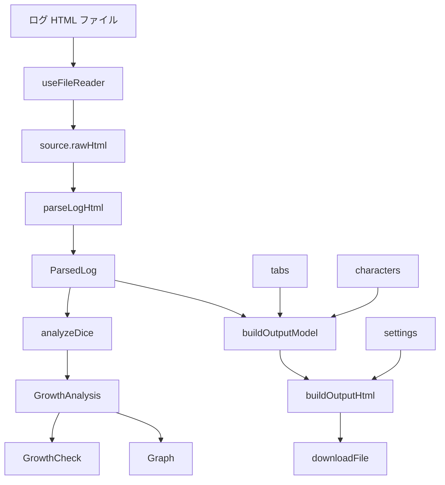
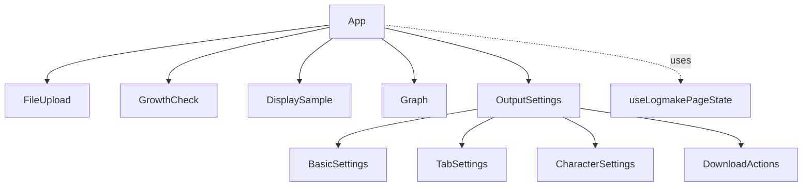

# Logmake Architecture

## 目的

`index_logmake.html` にまとまっていた Vue 実装を、React + TypeScript で読みやすく保守しやすい形へ移行する。

このページの主目的は、ユーザーが読み込んだ TRPG ログから、設定を反映した HTML ファイルをダウンロードできるようにすること。成長判定とグラフは、その作業を助ける補助機能として扱う。

## 入口

- `logmake/index.html`
  React 版ログ整形ツール専用の HTML 入口。
- `src/logmake/main.tsx`
  React を起動するだけのファイル。機能ロジックは置かない。
- `src/logmake/App.tsx`
  ページ全体の並びを決める場所。状態制御は `useLogmakePageState()` に寄せる。

## フォルダ責務

| 場所                               | 責務                                                                                               |
| ---------------------------------- | -------------------------------------------------------------------------------------------------- |
| `src/logmake/components/features/` | ユーザーが触る機能単位の UI。ファイル選択、成長判定、サンプル、グラフ、出力設定など。              |
| `src/logmake/hooks/`               | React のライフサイクルと関係する再利用処理。ファイル読込、初期技能 JSON 取得、クリップボードなど。 |
| `src/logmake/lib/`                 | React に依存しない純粋な処理。ログ解析、ダイス分析、出力モデル作成、HTML 生成など。                |
| `src/logmake/styles/`              | logmake ページ専用 CSS Modules。旧 `styles.css` の見た目に寄せる。                                 |
| `src/logmake/types/`               | TypeScript の型定義。データの形を先に読めるようにする。                                            |
| `src/logmake/test/`                | unit test と fixture。解析や出力の回帰確認に使う。                                                 |

## データフロー

重要なのは、画面に出ている DOM から HTML を取り出さないこと。旧実装の hidden DOM + `innerHTML` 方式ではなく、データから直接 HTML 文字列を作る。

## コンポーネント構成

`DisplaySample` は旧画面と同じ静的な表示形式サンプル。読み込んだログのプレビューではない。出力に必要な実データは `OutputModel` として内部で受け渡す。

## UI 方針

- ユーザー向け画面には、学習用の説明を出さない。
- 旧 `index_logmake.html` と `styles.css` の見た目、文言、操作順序にできるだけ寄せる。
- component ごとにカードや箱を増やさず、ページ全体を 1 つの `box5` 相当の領域に入れる。
- 内部は旧画面と同じく `details`, `table`, `button` 中心で構成する。

## 設計判断

- `parseLogHtml`, `analyzeDice`, `buildOutputModel`, `buildOutputHtml` は React に依存させない。
- `OutputModel` はダウンロード HTML 生成用の中間モデルであり、画面プレビュー用モデルではない。
- 成長判定の表示フィルタは `GrowthCheck` 内部に閉じる。出力 HTML には影響しないため、`TabConfig` には混ぜない。
- Zustand はまだ使わない。現在は `App` 直下に feature が並ぶだけで、深い prop drilling が発生していないため。

## 今後の改善候補

- `parseLogHtml()` を `DOMParser` ベースへ移行する。
- タブ名やキャラクター名を key にする構造から、ID ベース構造へ寄せる。
- グラフの表示切替や画像保存を検討する。
- 設定の localStorage 永続化が必要になったら、Zustand 導入を再検討する。
